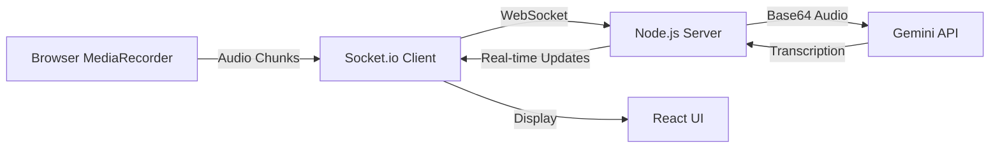

# ScribeAI - AI-Powered Meeting Transcription

Real-time audio transcription and summarization tool powered by Google Gemini AI.

## Features

- 🎤 **Real-time Transcription**: Capture audio from microphone or browser tabs (Google Meet, Zoom, etc.)
- ✨ **AI Summaries**: Automatic generation of meeting summaries with key points and action items
- 💾 **Session Management**: Store and retrieve past recording sessions
- 🎨 **Modern UI**: Beautiful, responsive interface with dark mode
- ⚡ **Live Updates**: Real-time transcript updates via WebSocket connection

## Tech Stack

- **Frontend**: Next.js 16 (App Router), React 19, TypeScript, Tailwind CSS
- **Backend**: Node.js with Socket.io for real-time communication
- **Database**: SQLite (via Prisma ORM) - easily switchable to PostgreSQL
- **AI**: Google Gemini API for transcription and summarization
- **Icons**: Lucide React

## Prerequisites

- Node.js 20.17.0 or higher
- npm or yarn
- Google Gemini API key (get free at [ai.google.dev](https://ai.google.dev))

## Quick Setup

### 1. Clone and Install

```bash
cd scribe-ai
npm install
```

### 2. Configure Environment Variables

Copy `.env.example` to `.env` and add your Gemini API key:

```bash
DATABASE_URL="file:./dev.db"
GEMINI_API_KEY="your-api-key-here"
```

### 3. Initialize Database

```bash
npx prisma migrate dev --name init
npx prisma generate
```

### 4. Run Development Server

```bash
npm run dev
```

Open [http://localhost:3000](http://localhost:3000) in your browser.

## Usage

### Starting a Recording Session

1. Click "Start Recording" on the dashboard
2. Choose audio source:
   - **Microphone**: Direct audio input from your mic
   - **Tab/Screen Share**: Capture audio from browser tabs (e.g., Google Meet)
3. Grant browser permissions when prompted
4. Click "Start Recording" to begin

### During Recording

- **Pause/Resume**: Control recording flow
- **Live Transcript**: View real-time transcription as you speak
- **Stop**: End the session and generate AI summary

### After Recording

- View AI-generated summary with:
  - Key discussion points
  - Action items
  - Decisions made
- Export or save transcript for future reference

## Architecture

### Audio Processing Pipeline



### Key Components

- **`server.ts`**: Custom Node.js server handling Next.js + Socket.io
- **`lib/gemini.ts`**: Gemini API integration for transcription/summarization
- **`app/record/page.tsx`**: Main recording interface with MediaRecorder
- **`prisma/schema.prisma`**: Database schema for users, sessions, transcripts

## Long-Session Scalability

### Current Implementation

The app handles long recording sessions (1+ hour) through:

1. **Chunked Streaming**: Audio is sent in 5-second chunks to prevent memory overflow
2. **Incremental Transcription**: Each chunk is transcribed independently
3. **Server-side Aggregation**: Transcripts are accumulated in memory during session
4. **Efficient Cleanup**: Session data is cleared after summary generation

### Scalability Considerations

| Approach | Latency | Reliability | Scalability |
|----------|---------|-------------|-------------|
| **Current (Streaming)** | Low (~5s delay) | High (auto-retry) | Good (chunked) |
| **Upload After Recording** | High (post-process) | Medium (single point) | Limited (file size) |
| **Hybrid (Buffer + Stream)** | Medium | Very High | Excellent |

### Production Recommendations

For production deployment with concurrent sessions:

- **Database**: Switch to PostgreSQL for persistent storage
- **Queue System**: Implement Redis/Bull for async transcription jobs
- **CDN Storage**: Store audio files in S3/Cloud Storage
- **Rate Limiting**: Implement API rate limits for Gemini calls
- **Session Recovery**: Add reconnection logic for network interruptions
- **Horizontal Scaling**: Use Redis adapter for Socket.io across multiple servers

## Browser Compatibility

- ✅ Chrome/Edge (Recommended)
- ✅ Firefox
- ⚠️ Safari (Limited tab audio capture support)

## Known Limitations

- Tab audio capture requires HTTPS in production
- Gemini API has rate limits (check your quota)
- Large sessions (2+ hours) may require optimization
- Browser must stay active during recording

## Development

### Project Structure

```
scribe-ai/
├── app/                  # Next.js app directory
│   ├── page.tsx         # Dashboard
│   ├── record/          # Recording interface
│   └── layout.tsx       # Root layout
├── lib/                 # Utility functions
│   ├── gemini.ts        # AI integration
│   └── utils.ts         # Helper functions
├── prisma/              # Database schema
├── server.ts            # Custom server
└── public/              # Static assets
```

### Available Scripts

- `npm run dev` - Start development server
- `npm run build` - Build for production
- `npm run start` - Start production server
- `npm run lint` - Run ESLint

## Troubleshooting

### "Permission denied" for microphone/screen

- Check browser permissions in Settings
- Ensure HTTPS in production (required for getUserMedia)

### No transcription appearing

- Verify Gemini API key is correct
- Check browser console for errors
- Ensure audio is being captured (check browser audio indicator)

### Socket.io connection failed

- Verify server is running on port 3000
- Check firewall settings
- Review server logs for errors

## Future Enhancements

- [ ] Multi-speaker diarization
- [ ] Real-time translation
- [ ] Export to PDF/DOCX
- [ ] Calendar integration
- [ ] Team collaboration features
- [ ] Custom vocabulary training

## License

MIT

## Support

For issues or questions, please open an issue on GitHub.

---

**Built with ❤️ using Next.js and Google Gemini**
